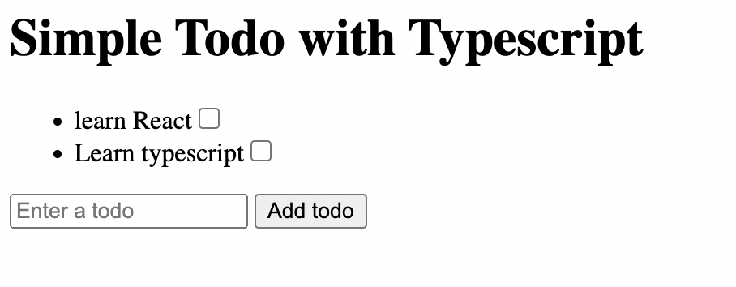

# Simple-Todo-with-Typescript

### Project description

This is a simple todo website build with HTML and Typescript. In this project, you can

1. create a todo task
2. update the state of the todo task
3. save & retreive the todo tasks to localStorage

### How to Run this project

you can use live-server to run this project
